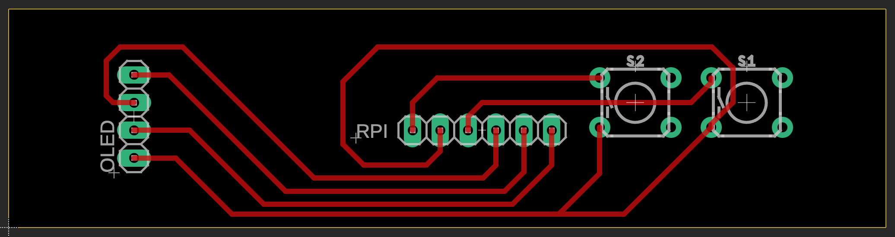

# pi_nas

## Bare bones Raspberry Pi NAS server


Objective was to have a simple small NAS server for local backup of my Mac using Time Machine. Setup of the Pi was based almost to the letter on [Using a Raspberry Pi for Time Machine](NASSetupArticle.pdf) by Oleg Ovechkin.

NOTE: That article, while great, is three years old as of this writing. So don't be shocked if some things behave a bit differently by the time you see this. For example, I'm pretty sure that whole section about `cd /Volumes/boot && touch ssh && cd` is unnecessary.

## Steps

1. Obtain parts. I purchased a Raspberry Pi 5, a PNY 4TB SATA drive, and a Homerun USB3.0 to SATA-III adapter. For the "hat" I used prototype board, headers, buttons, and a 0.91 Inch I2C OLED display that I had laying around.
2. Set up the Pi. Follow the Ovechkin article referenced above. I copied my `smb.conf`, `samba.service`, `hdparm.conf`, and `fstab` files into this repository just so I could easily reproduce this setup. I also captured some memorable commands from my [shell history](history.bash), but if you follow the article you shouldn't need any of that.
3. Support the Pi. You can print [NAS Spacer.stl](NAS_Spacer.stl) on a 3D printer so the Pi doesn't bounce around being suspended only by the USB interface. Or if you're not fancy you could use a blob of hot glue.
4. Enable I2C in the Interfaces section of `sudo raspiconfig`.
5. Install the [adafruit-circuitpython-ssd1306](https://docs.circuitpython.org/projects/ssd1306/en/latest/) python library so the buttons can talk to the OLED display.
6. Build the hat. It uses pins 1 through 6 on the Pi header to give you push-button status on SATA drive utilization. I didn't bother etching a circuit board for this, but I included the Eagle [nas_control_v1.brd](nas_control_v1.brd) and [nas_control_v1.sch](nas_control_v1.sch) files for documentation purposes. The signals on Pi pins 1 through 6 are `VCC`, `SDA`, `SCK`, `GP04`, `GND`, and `GP17`:



Finally, you'll need to write a python script such as [disk_status.py](disk_status.py) to listen for push buttons. Set up the script to restart every time the Pi boots by putting the following into your crontab:

```bash
@reboot /home/pi/disk_status.py &
```

In my case the button on the left causes the OLED display to cycle through some disk drive status strings:

```python
oledPrint(f"{total_tb:.2f} TB total")
oledPrint(f"{used_tb:.2f} TB used")
oledPrint(f"{free_tb:.2f} TB free")
oledPrint(f"{percent_used:.1f}% used")
```

and the button on the right resets the Pi:

```python
oledPrint("Rebooting...")
os.system("sudo reboot")
```
